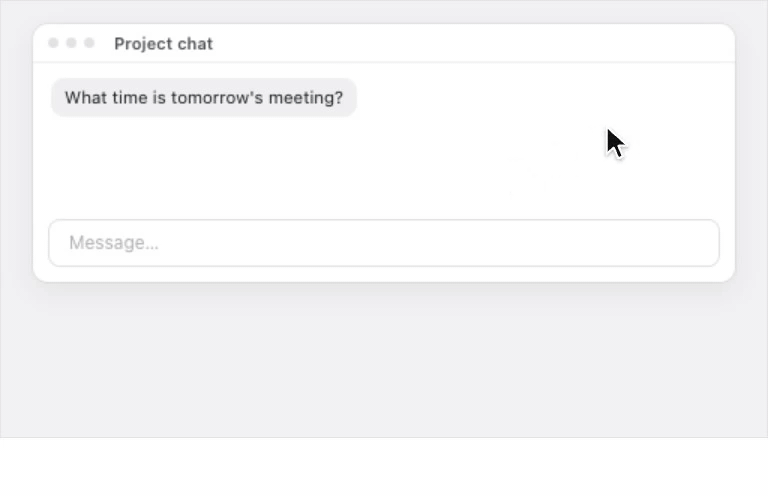
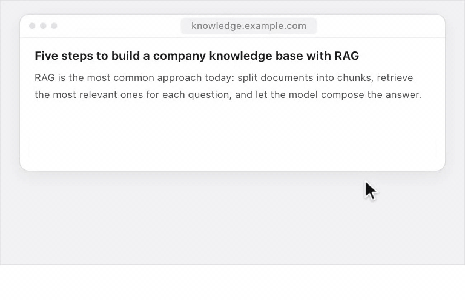
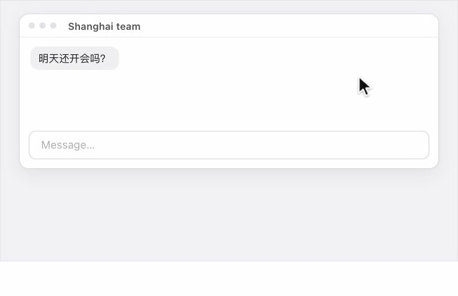

<p align="center">
  
</p>

<h1 align="center">Typefree</h1>

<p align="center"><b>AI voice input for macOS: hold, talk, release — the text is already cleaned up and sitting at your cursor.</b></p>

<p align="center">
  <a href="https://github.com/kdsz001/typefree/releases/latest"></a>
  <a href="mac/LICENSE"></a>
  
</p>

<p align="center">
  <a href="https://github.com/kdsz001/typefree/releases/latest/download/Typefree.dmg"><b>Download for Mac</b></a> ·
  <a href="https://typefree.app/index.en.html">Website</a> ·
  <a href="https://typefree.app/setup-guide.en.html">API key setup guide</a> ·
  <a href="README.md">中文</a>
</p>

<p align="center">
  
</p>

## What it does

In any app's text field, hold a hotkey or the left mouse button and talk. When you let go, the transcript goes through an LLM that strips filler words, fixes the sentence, adds punctuation and paragraphs, and types the result at your cursor. Say it once, no editing afterwards.

- **Voice to text** — recognition and cleanup in one step; works in chat apps, notes, browsers and code editors
- **Hold the mouse to talk** — no hotkey needed; drag down a little to lock if you want to let go mid-sentence, drag far away to cancel
- **Ask AI anywhere** — hold the mouse on empty space and ask; the answer appears in the top-right corner, with follow-ups and pinning
- **Voice translation** — end your sentence with "in Chinese" (or "Japanese", "Korean"…) and it is typed in that language
- **Learns from your fixes** — correct a misheard name or product term once and it is recognized next time; you can also add words to your vocabulary
- **History** — everything you dictate is stored encrypted on your Mac, exportable, kept as long as you choose
- **Multiple providers** — Volcengine for speech recognition, Qwen for cleanup, with the model picked automatically by quality and speed

Chinese and English speech are both supported. The cleanup prompts are tuned first for Chinese, so that is where it shines most.

## Three ways to use it

| | How to start | Cost |
|---|---|---|
| **Free trial** | [Download the DMG](https://github.com/kdsz001/typefree/releases/latest/download/Typefree.dmg) and start talking — nothing to configure | Free for 7 days, paid for by the author |
| **Bring your own key** | Paste your own API key under Settings → Models ([guide](https://typefree.app/setup-guide.en.html), a few minutes) | **Free forever, no word limit**; usage is billed to your own account |
| **Membership** | Don't want to get a key? Membership covers recognition, cleanup and Ask AI | $26 / year |

The trial and membership channels only exist in the signed build (the DMG from the website or Releases). A build you compile yourself has neither — paste your own key after installing and every feature works the same.

## Ask AI anywhere

<p align="center">
  
</p>

No window switching, no copying: hold the mouse on some empty space and ask. Hold the answer panel to follow up. Click outside and it shrinks to one line and fades out; click the pin to keep it.

## Voice translation

<p align="center">
  
</p>

Commands are matched by rule, not guessed by the model. English, Chinese, Japanese and Korean are on by default; French, German and Spanish can be enabled on the Explore page. You can also fix one output language so you never have to say the command.

## Privacy

- Your API keys live in the macOS Keychain and are never uploaded
- With your own key, audio goes straight to the provider you chose, never through the author's server
- The trial and membership channels relay through the author's server, which forwards and does not store audio or text
- History is stored encrypted on your Mac

Full details in the [privacy policy](https://typefree.app/privacy.en.html).

## Build from source

Requires macOS 14+ and Xcode 26.3.

```bash
git clone https://github.com/kdsz001/typefree.git
cd typefree/mac
./build.sh                      # output in dist/
bash scripts/install_app.sh     # installs to /Applications
```

Details, directory layout and tests: [mac/README.md](mac/README.md) (Chinese, with an English summary).

## Repository layout

- `mac/` — the complete macOS app (Swift, GPL-3.0)
- root — the website [typefree.app](https://typefree.app) (GitHub Pages)

## License and trademark

The code is licensed under the [GNU GPL-3.0](mac/LICENSE): use, modify and redistribute freely, as long as derived software is also GPL. **The "Typefree" name, icon and website content are not covered by the license** — please don't ship your own build under that name.

## Feedback

- The "Feedback" page in the app's sidebar talks straight to the author, screenshots included
- Or open an [issue](https://github.com/kdsz001/typefree/issues): bugs, ideas, examples of bad transcripts are all welcome, in English or Chinese
- Pull requests are currently limited to small fixes — see [CONTRIBUTING](mac/CONTRIBUTING.md)
