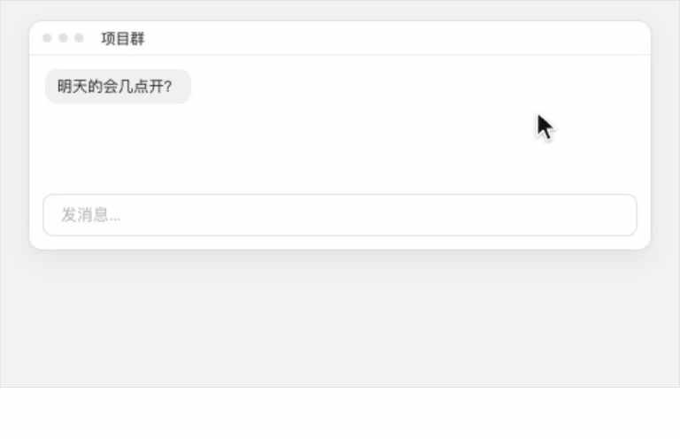
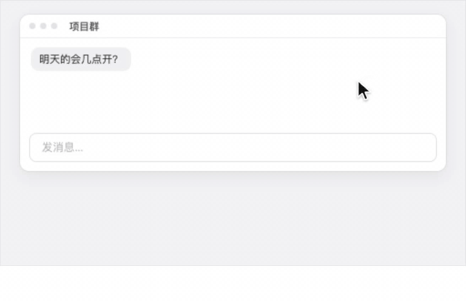
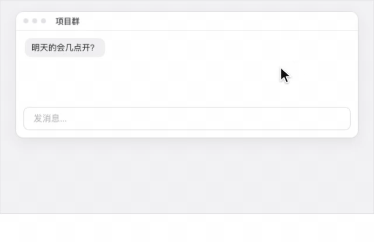

<p align="center">
  
</p>

<h1 align="center">Typefree</h1>

<p align="center"><b>macOS 上的 AI 语音输入：按住说话，松手时文字已经整理好、进了光标处。</b></p>

<p align="center">
  <a href="https://github.com/kdsz001/typefree/releases/latest"></a>
  <a href="mac/LICENSE"></a>
  
</p>

<p align="center">
  <a href="https://github.com/kdsz001/typefree/releases/latest/download/Typefree.dmg"><b>下载 Mac 版</b></a> ·
  <a href="https://typefree.app">官网</a> ·
  <a href="https://typefree.app/setup-guide.html">API Key 配置教程</a> ·
  <a href="README.en.md">English</a>
</p>

<p align="center">
  
</p>

## 它做什么

在任何 App 的输入框里，按住快捷键或鼠标左键说话。松手后，识别出的口语会被 AI 去掉「嗯、啊、那个」，理顺句子、加上标点和分段，然后直接输入到光标处。说一句是一句，不用再改。

- **说话变文字**：识别 + AI 整理一步到位，微信、备忘录、浏览器、代码编辑器都能用
- **鼠标长按说话**：不想按快捷键，就在输入框里按住鼠标；说一半想松手，向下拖一点锁定；不想要了，拖远取消
- **随时问 AI**：在空白处按住鼠标说出问题，回答出现在屏幕右上角，可追问、可固定
- **语音翻译**：说完正文，结尾加一句「用英文」，这句直接输入成英文；日文、韩文同理
- **越用越准**：专有名词、人名、产品名自动学习；你改过的错字下次自动纠正
- **历史记录**：所有输入在本机加密保存，可搜索、可导出
- **多家模型**：识别用火山引擎 / 阿里百炼，整理用通义千问 / 豆包 / 智谱，按质量和速度自动路由

## 三种用法

| | 怎么开始 | 费用 |
|---|---|---|
| **免费试用** | [下载 DMG](https://github.com/kdsz001/typefree/releases/latest/download/Typefree.dmg)，装好就能用，不用配任何东西 | 7 天免费，由作者承担 |
| **自带 Key** | 在「设置 → 模型」填入你自己的 API Key（[教程](https://typefree.app/setup-guide.html)，几分钟） | **永久免费，不限字数**；费用走你自己的账户 |
| **会员** | 不想申请 Key，就开通会员，识别、整理、问 AI 全包 | ¥188 / 年 |

试用和会员通道只在官方签名版（官网 / Releases 的 DMG）里可用。自己从源码编译的版本没有这两条通道，装好后填入自己的 Key 即可，功能完全一样。

## 随时问 AI

<p align="center">
  
</p>

看到不懂的，不用切窗口、不用复制，在空白处按住鼠标问一句。按住回答面板可以接着问；点面板外面它会缩成一行、几秒后消失，想留住就点图钉。

## 语音翻译

<p align="center">
  
</p>

口令是程序规则识别的，不靠模型猜：默认支持英文、日文、韩文、中文，法语、德语、西班牙语可以在设置里打开。也可以固定一种输出语言，不用每次说口令。

## 隐私

- API Key 只保存在本机钥匙串，不上传
- 自带 Key 时，音频直接发给你选的模型厂商，不经过作者的服务器
- 试用和会员通道经作者的服务器转发，只转发、不保存音频和文字
- 历史记录在本机加密存储

完整说明见 [隐私政策](https://typefree.app/privacy.html)。

## 从源码构建

要求 macOS 14+、Xcode 26.3。

```bash
git clone https://github.com/kdsz001/typefree.git
cd typefree/mac
./build.sh                      # 产物在 dist/
bash scripts/install_app.sh     # 安装到 /Applications
```

细节、目录说明和测试方法见 [mac/README.md](mac/README.md)。

## 仓库结构

- `mac/` — macOS App 完整源码（Swift，GPL-3.0）
- 根目录 — 官网 [typefree.app](https://typefree.app)（GitHub Pages）

## 许可与商标

代码以 [GNU GPL-3.0](mac/LICENSE) 开源：可以自由使用、修改、再分发，但基于它的软件也必须以 GPL 开源。**「Typefree」名称、图标与官网内容不在开源许可范围内**，请勿用于你自己发布的版本，以免用户混淆。

## 反馈

- App 侧栏的「反馈」页可以直接和作者对话，能附截图
- 或者提 [Issue](https://github.com/kdsz001/typefree/issues)：bug、想法、识别不准的例子都行
- Pull Request 目前只接受小修，见 [CONTRIBUTING](mac/CONTRIBUTING.md)
